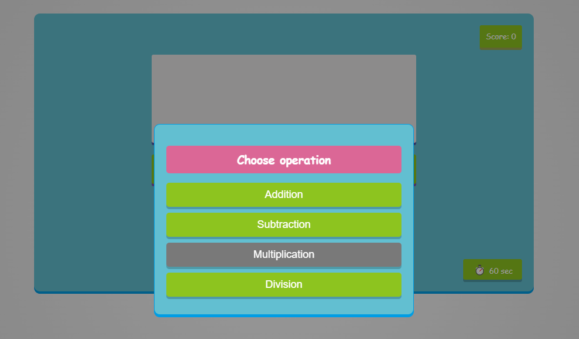
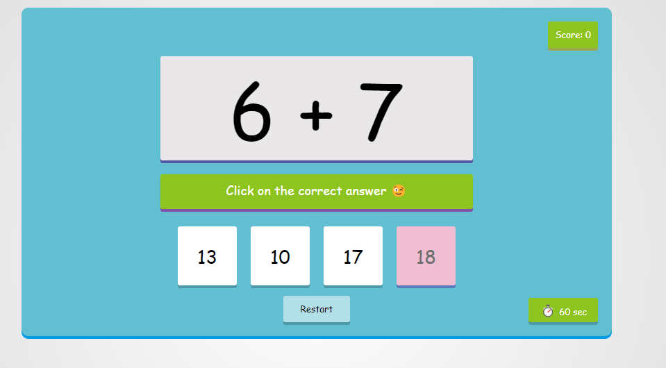
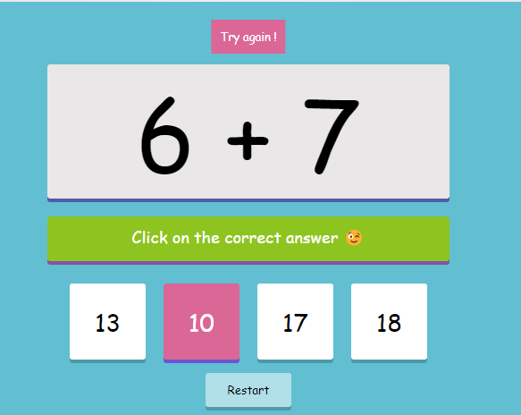

Maths Game

A simple web-based mathematics game where users can practice basic arithmetic operations like addition, subtraction, multiplication, and division. The game is designed with a user-friendly interface and provides instant feedback on correct and incorrect answers.

## Table of Contents

- [Features](#features)
- [Demo](#demo)
- [Screenshots](#screenshots)
- [Installation](#installation)
- [Usage](#usage)
- [Customization](#customization)
- [License](#license)

## Features

- Practice basic arithmetic operations (Addition, Subtraction, Multiplication, Divisionfeatures)
- [Screenshots](#screenshots)
- [Installation](#installation)
- [Usage](#usage)
- [Customization](#customization)
- [License](#license)

## Features

- Practice basic arithmetic operations (Addition, Subtraction, Multiplication, Division).
- Simple and user-friendly interface suitable for all ages.
- Score tracking with real-time feedback:
- +1 for a correct answer.
- Displays "Correct" or "Try again" feedback without changing the question.
- Timer functionality to challenge the user to solve as many questions as possible within the time limit.

## Demo

Try out the Maths Game by visiting the following link:

https://maths-game.sissy-chen.host20.uk/

## Screenshots

## Installation

To run this project on your local machine, follow these steps:

1. **Clone the repository:**

git clone https://github.com/sissy-ch/maths_game.git
cd maths_game

2. **Open the project:**

Open the project in your preferred code editor.

3. **Run the project:**

Open index.html in your browser to start the game.

## Usage

- Upon starting the game, you can select the arithmetic operation you want to practice.

- Solve the given mathematical questions by selecting the correct answer from the four options.

- The game keeps track of your score and provides instant feedback. You can restart the game at any time by pressing the "Reset" button.

## Customization

You can customize the game by modifying the following:

- Colors: Adjust the color scheme in the styling.css file.
- Operations: Modify or add more arithmetic operations in the generateQA function in javascript.js.
- Timer: Adjust the countdown timer duration by changing the timeRemaining variable in javascript.js.

## License

This project is licensed under the MIT License - see the LICENSE file for details.
